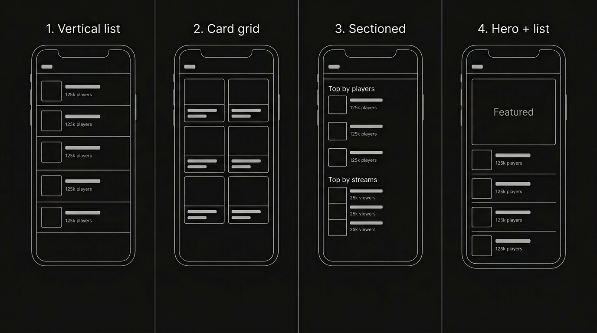

# GameTrend Front-End Build: Popular Tab Layout

---

## Popular tab layout: default and preferences

**Default layout:** **Hero + list** (layout 4) is the main layout for the Popular tab. One featured game in a large hero card at the top, then a vertical list of other popular games below. This gives a clear spotlight plus browse.

**Customizable preferences:** Users can switch the Popular tab to one of three other layouts in settings:

| Option                    | Layout                                                                   | Best for                                 |
| ------------------------- | ------------------------------------------------------------------------ | ---------------------------------------- |
| **Hero + list** (default) | One large featured game at top, then list                                | Spotlight + browse; recommended default. |
| **Vertical list**         | Full-width rows (thumbnail + name + stats), one per game                 | Dense list, many games, quick scan.      |
| **Card grid**             | 2-column grid of game cards                                              | Visual, thumbnail-heavy, scannable.      |
| **Sectioned**             | "Top by players" and "Top by streams" (or similar) with small lists each | Grouping by metric (players vs viewers). |

Persist the user's layout choice (e.g. in local storage or app settings) so the Popular tab opens in their preferred layout on next launch.

### Layout reference

_Top-left: Vertical list. Top-right: Card grid. Bottom-left: Sectioned. Bottom-right: Hero + list (default)._

---

## Popularity timeline / sparkline charts

Mini line charts on game cards (player count or viewers over 24h/7d). Tap to expand to full chart. Shows whether a game is rising, peaking, or declining at a glance.

### Approach

**Phase 1 — Mock sparklines (no API):**

- Add a `history` array to each mock game object (e.g. 24 data points = hourly player counts over the past day).
- Build a lightweight `Sparkline` component using `react-native-svg` (SVG path from data points).
- Embed the sparkline on each card type (Hero, Row, Grid) next to or below the stats.
- Tap to expand into a full chart in the detail modal.

**Phase 2 — Real data:**

- Backend polls Steam/Twitch APIs periodically (e.g. every hour) and stores snapshots in a time-series table.
- Endpoint returns `{ gameId, points: [{ timestamp, playerCount, viewerCount }] }` for 24h, 7d, or 30d.
- Frontend fetches per game (or batched for top N) and replaces mock data.

**ViewsBadge** — **Implemented**
Purple pill with eye icon + formatted view count (e.g. "56K"), matching the trend-badge style. Used across all card types.

| Card             | Views badge                               | Percent (trend) badge                                                     | Rating (hero only)                                   |
| ---------------- | ----------------------------------------- | ------------------------------------------------------------------------- | ---------------------------------------------------- |
| **GameHeroCard** | Below game image, left side.              | Below the graph, right side (same row as rating).                         | Bottom left under graph, same line as percent badge. |
| **GameRowCard**  | Bottom row, left.                         | Bottom row, right (same line as views; `badgesRow` with `space-between`). | —                                                    |
| **GameGridCard** | Badge row, right side (opposite percent). | Badge row, left side.                                                     | —                                                    |

**Hero card:** One row under the graph: rating text left, trend badge right (`ratingAndBadgeRow`). **Row card:** One bottom row: views left, percent right; reduced top padding on badges row and half bottom padding on main row. **Grid card:** Badge row below stats with percent (trend) left, views right.

### Charting library

- **react-native-svg** + custom path for card sparklines — lightweight, no native dependency issues, full control.
- **victory-native** or custom SVG chart for the expanded detail view (axes, tooltips, animations).
- Alternative: **react-native-wagmi-charts** — built for sparkline-style financial charts with gesture-based scrubbing.

### Innovative sub-features

# 1. **Trend badge with color-coded sparkline** — **Implemented**

Color the sparkline by trend direction: green line + upward arrow = rising, red line + downward arrow = declining, gray = stable. Instant "is this game going up or down" without reading numbers. Live on all cards (Hero, Row, Grid) and in the detail modal; uses mock 24h history and animated draw-in.

# 2. **Scrub-to-see (finger on the sparkline)** — **Implemented**

On the expanded chart (and optionally hero card sparkline), drag finger along the line to see exact player count at each point in time. Tooltip follows finger (e.g. "2 PM — 1.2M players"); dot on line at scrubbed point. Live in detail modal and on hero card; uses PanResponder, no new dependencies.

# 2a. **Scrubbing and tooltip refinements** — **Implemented**

- **Overlay charts:** In dual/All mode, secondary (and tertiary) sparklines are overlaid with `position: absolute` so all lines share the same chart area instead of stacking vertically.
- **Scrub dots on line:** Secondary/tertiary scrub dots use `getYAtX(points, x)` so the marker stays exactly on its trend line; primary dot rendered on top (zIndex) so both (or all three) markers are visible.
- **Tooltip:** Semi-transparent background; raised above the marker; single time label (white) with metric values in a row, each colored to match its series (players, streams, views). In dual/All mode, values shown side-by-side.

# 3. **Event markers on the timeline** — **Implemented**

Mark notable moments on the chart with small dots or icons: game update/patch released, major streamer started playing, sale started, rating changed. Adds context that raw numbers don't.

# 4. **Multi-metric toggle on expanded chart** — **Implemented**

In the expanded view, switch between: player count over time, stream/viewer count over time, views over time, or all three overlaid. Toggle options: **Players**, **Streams**, **Views**, **All**. Reveals patterns like "streams spiked first, then players followed 2 hours later." Mock data includes `viewHistory` (24h view counts) and `formatViewCount`; detail modal shows views in stats, chart (purple line in All mode), legend, and scrubbing tooltip.

# 4a. **Views tracker** — **Implemented**

View-count metric alongside players and streams: `generateViewHistory` / `viewHistory` and `formatViewCount` in mock data; **Views** and **All** options in metric toggle; tertiary (views) line and scrub dot in `SparklineScrubbable` (triple mode); views in detail modal header, chart, legend, and tooltip (players / streams / views in one row with single time label).

# 5. **Comparison sparklines** — **Implemented**

On expanded chart, "Compare with..." button overlays another game's sparkline. Quick visual: "Is Elden Ring growing faster than Baldur's Gate 3 this week?" Bridges into the Game comparison mode feature.

- **GameComparisonPicker** (`app/components/GameComparisonPicker.js`): Bottom-sheet-style modal listing all games (excluding the current one) with thumbnail, name, player count, and trend badge. Tap to select; calls `onSelect(game)` and closes.
- **Compare button/chip** in `GameDetailModal`: Below the metric toggle, an orange outline "Compare with..." button opens the picker. Once a comparison game is selected, a dismissible chip shows "vs [Game Name]" with an X to clear. Switching to "All" mode auto-clears the comparison (already 3 overlaid lines).
- **Comparison overlay**: In single-metric modes (Players, Streams, Views), the comparison game's data is passed as `secondaryData` with `dualMode=true` to `SparklineScrubbable`, using the app's primary/accent color for the comparison line.
- **Comparison legend**: When active, a legend row below the chart shows the current game name (in the metric's color) and the comparison game name (in accent color) with color dots.
- **Comparison-aware tooltip**: New `primaryLabel`/`secondaryLabel` props on `SparklineScrubbable`; when provided, the dualMode tooltip shows game names as labels (e.g. "Elden Ring: 98.0K" / "Baldur's Gate 3: 156.0K") instead of metric names.

# 6. **"Best time to play" sparkline annotation** — **Implemented**

On expanded chart, highlight peak player window with a subtle shaded region. "Most players online: 7–10 PM EST." Bridges into the Peak time predictor feature.

- **`findPeakWindow(history, windowSize)`** (`app/data/mockPopularGames.js`): Pure utility that slides a window (default 3 hours) across any numeric history array and returns `{ startHour, endHour, avgCount }` for the contiguous window with the highest average. Reusable for the future Peak Time Predictor feature.
- **SVG peak region** (`Sparkline.js`): New `peakRegion` prop `{ x1, x2, color }` renders a rounded `Rect` with a vertical gradient fill (18% opacity bottom to 6% top) and dashed border lines (30% opacity) at the left/right edges of the peak window. Rendered between the area fill and the stroke for correct layering.
- **Floating peak label** (`SparklineScrubbable.js`): Always-visible pill positioned above the peak region showing a clock icon and "Peak: 7 PM–9 PM" text in the peak color (`colors.success` green). Uses absolute positioning centered on the peak region.
- **Scrub-in-peak indicator**: When scrubbing inside the peak zone, a star icon and "Peak" text appear at the bottom of the tooltip, providing contextual awareness.
- **Metric-aware**: Peak window recalculates when switching metrics (Players/Streams/Views). In "All" mode, peak is computed from the primary (player) history. Comparison mode shows only the current game's peak.

# 7. **Sparkline on share cards**

A "Share" button in the game detail modal generates a polished, branded 400×560 image card and opens the native share sheet. The card contains the game's thumbnail (with dark gradient overlay), name, color-coded stats (players, streams, views), a full-width sparkline with peak-region highlight, trend badge, views badge, rating, and a "GameTrend" branding footer.

- **New component `GameShareCard.js`**: A `React.forwardRef` presentational component rendered off-screen (`position: absolute`, `left: -9999`, `opacity: 0`) inside the detail modal. Uses the existing `Sparkline` component with `animated={false}` and optional `peakRegion` prop for the peak highlight. Designed purely for screenshot capture — no interactivity or PanResponder overhead.
- **New dependencies**: `react-native-view-shot` (captures a React Native view as PNG) and `expo-sharing` (opens the native share sheet with a file URI). Compatible with Expo SDK 55, iOS, Android, and web.
- **Share flow**: `captureRef(shareCardRef, { format: "png", quality: 1 })` captures the off-screen card after a 100ms delay (ensures SVG render). On native, `expo-sharing` opens the share sheet. On web, a download link is created programmatically.
- **Share button**: Rendered next to the "Ask in Chat" button as a bordered icon button (`share-outline` icon, `colors.primary` outline). Shows an `ActivityIndicator` while capturing/sharing.
- **Peak region on share card**: Computed from the player history using `getPoints` and `findPeakWindow`, mapped to the share card's 360px chart width.

# 8. **Historical "all-time" view** -- **Implemented**

A `TimeRangeToggle` (24h / 7d / 30d) in the detail modal lets users switch between hourly (24-point), weekly (168-point), and monthly (30-point) chart resolutions. The full game lifecycle -- launch spikes, steady states, DLC bumps, declines -- is visible on 30d. Nobody does this well on mobile; GameTrend does.

- **New data generators** (`mockPopularGames.js`): Six new functions (`generateHistory7d`, `generateStreamHistory7d`, `generateViewHistory7d`, `generateHistory30d`, `generateStreamHistory30d`, `generateViewHistory30d`) produce multi-resolution mock data with daily sine modulation (7d) and weekly periodicity with event bumps (30d). Each game in `MOCK_GAMES` now has 9 history arrays (3 metrics x 3 resolutions).
- **New formatters** (`mockPopularGames.js`): `formatHourIn7d(position)` renders "Mon 2 AM"-style labels for 7d scrubbing; `formatDayLabel(position)` renders "Mar 15"-style labels for 30d. Both are passed as `formatTimeLabel` overrides to `SparklineScrubbable`.
- **New component `TimeRangeToggle.js`**: Compact segmented control matching `MetricToggle` style (same pill shape, border, animation) with `colors.secondary` (cyan) accent. Three segments: 24h (`time-outline`), 7d (`calendar-outline`), 30d (`calendar`). Placed below `MetricToggle` with a small gap.
- **Data selection logic** (`GameDetailModal`): `useMemo`-based `rangeData` and `compRangeData` objects pick the correct history arrays from the game object based on `activeRange`. All `SparklineScrubbable` instances receive `rangeData.players` / `.streams` / `.views` instead of the hardcoded 24h arrays. Comparison game data also switches range.
- **X-axis scale labels**: Below the sparkline, a `flexDirection: "row", justifyContent: "space-between"` row renders 5-7 subtle time labels: day names for 7d, date stamps for 30d, clock times for 24h. Gives the chart a professional axis feel.
- **Range-aware peak annotation**: `peakLabelFormatter` prop added to `SparklineScrubbable`; when provided, the peak badge uses it instead of the default `formatTimeForIndex`. For 7d, shows "Mon 2PM"-style; for 30d, shows "Mar 15"-style peak labels.
- **Range change clears comparison**: Switching range resets `comparisonGame` to null (comparison data must match range). Event markers only shown in 24h mode (they reference `hourIndex` 0-23).

# 9. **Animated sparkline on first load with sparkle effect** -- **Implemented**

When a card appears, the sparkline draws itself left-to-right over 800ms. A bright sparkle particle rides the leading edge of the line as it reveals, color-matched to the trend color, creating a signature "data coming alive" effect.

- **Sparkle overlay** (`Sparkline.js`): Three concentric SVG layers rendered on top of the animated stroke:
  - **Outer glow**: `Circle` r=6 filled by a `RadialGradient` from the line color at 50% opacity (center) to transparent (edge).
  - **Inner bright core**: `Circle` r=2.5, solid white at 90% opacity.
  - **Starburst rays**: Four `Line` elements at 0/45/90/135 degrees, white at 60% opacity, strokeWidth 0.8, length 4px. Rotate continuously via a looping `Animated.Value` (1200ms per revolution).
- **Position tracking**: `getSparklePos(points, progress)` interpolates between precomputed `getPoints` coordinates using the draw-in progress (1 -> 0). Three `addListener` callbacks on `dashOffset`, `sparkleOpacity`, and `sparkleRotation` update a single `sparkle` state object `{ cx, cy, opacity, rot }` on each animation frame.
- **Fade-out**: When the draw-in completes, the sparkle fades to opacity 0 over 200ms, then is removed from the tree.
- **Guard conditions**: The sparkle only renders when `useDrawAnimation` is true (`animated=true` and no `strokeDasharray`). This means: no sparkle on share card screenshots (`animated={false}`), no sparkle on secondary/tertiary overlay lines (they use `strokeDasharray`), and sparkle appears on all primary sparklines across Hero, Row, Grid cards and the detail modal.

### Implementation steps

| Step | What                                                            | Where                                                         |
| ---- | --------------------------------------------------------------- | ------------------------------------------------------------- |
| 1    | Add `history` array to mock game data                           | `app/data/mockPopularGames.js`                                |
| 2    | Install `react-native-svg`                                      | `package.json`                                                |
| 3    | Build `Sparkline` component (SVG path, color by trend)          | `app/components/Sparkline.js`                                 |
| 4    | Embed sparkline in GameHeroCard, GameRowCard, GameGridCard      | existing card components                                      |
| 5    | Build expanded chart in detail modal (time range toggle, scrub) | `app/components/GameDetailModal.js` or new `ExpandedChart.js` |
| 6    | Add trend badge (up/down/stable) next to sparkline              | card components                                               |
| 7    | Animate sparkline on first render                               | `Sparkline.js`                                                |

**Status:** Sub-features 1 (Trend badge with color-coded sparkline), 2 (Scrub-to-see), 2a (Scrubbing/tooltip refinements), 3 (Event markers on the timeline), 4 (Multi-metric toggle with Players/Streams/Views/All), 4a (Views tracker), 5 (Comparison sparklines), 6 ("Best time to play" annotation), 7 (Sparkline on share cards), 8 (Historical "all-time" view), and 9 (Animated sparkline with sparkle effect) implemented. ViewsBadge component and badge/rating placement per card type (hero, row, grid) as above.

---

---

# Add-On Features

The following features are planned extensions beyond the core sparkline chart system. They are not yet implemented and are listed here for future reference.

---

## Hype alerts / push notifications

Let users watch specific games and get notified when player count spikes, a major streamer goes live, or ratings change significantly.

**Status:** Implementation pending.

---

## Game comparison mode — **Implemented**

Dedicated side-by-side comparison view for 2–3 games (players, streams, ratings, sparklines, peak times). Implemented as a **third tab** ("Compare") in the bottom navigator.

- **CompareScreen** (`app/screens/CompareScreen.js`): Main screen with header ("Compare", "+ Add"), horizontal row of 3 **GameSlotPicker** cards, **CompareChartPanel** (shared scrubbable chart with MetricToggle and TimeRangeToggle), stat comparison table with per-row winner highlight and staggered row animation, and "Who's winning?" banner with weighted score (players 40%, streams 30%, views 20%, rating 10%), trophy icon, and lead percentage.
- **GameSlotPicker** (`app/components/GameSlotPicker.js`): Empty slot shows animated dashed border with pulsing glow and "Add game"; filled slot shows thumbnail, name, player count, TrendBadge, and X to remove. Tapping empty slot opens **GameComparisonPicker** (excludeIds = currently selected games).
- **CompareChartPanel** (`app/components/CompareChartPanel.js`): Renders up to 3 overlaid **SparklineScrubbable** lines (slot colors: primary, secondary, success), shared legend, X-axis labels, and metric/time-range toggles. Supports 24h / 7d / 30d and Players / Streams / Views / All (All uses players for overlay).
- **Slot persistence**: Selected game IDs are stored via `getCompareSlotIds` / `setCompareSlotIds` (localStorage on web, SecureStore on native) so the Compare tab restores the last comparison on reopen.
- **SparklineScrubbable**: Added **tertiaryLabel** prop and tooltip branch for 3-game comparison (primaryLabel, secondaryLabel, tertiaryLabel) so the scrub tooltip shows all three game names and values.

**Status:** Implemented.

---

## "Why is this trending?" AI summaries

When a game spikes in popularity, auto-generate a short AI summary (e.g. new DLC, big streamer, sale, controversy) so numbers have context.

**Status:** Implementation pending.

---

## Live stream previews

In game detail: show top 2–3 Twitch/YouTube streams inline (thumbnail, viewer count, tap to open). Connects stats to live content.

**Status:** Implementation pending.

---

## Peak time predictor — **Implemented**

Use historical player data to show when a game typically peaks (e.g. "peaks 3 PM EST weekdays, 8 PM weekends"). Helps with matchmaking timing.

- **`computePeakInsights(game)`** (`app/data/mockPopularGames.js`): Analyzes 24h, 7d, and 30d player history via existing `findPeakWindow`. Returns `{ daily, weekly, monthly, confidence }` with labels (e.g. "7 PM – 9 PM", "Sat 8 PM", "Mar 22 – Mar 24") and intensity (0–100) for each range. Confidence is `high` / `medium` / `low` from peak-to-overall ratio.
- **`isInPeakWindowNow(game)`** (`app/data/mockPopularGames.js`): Returns true when the current hour falls inside the 24h peak window; used for "Peak now" indicators.
- **`PeakTimePanel.js`** (`app/components/PeakTimePanel.js`): Card in the game detail modal with "Best Time to Play" header, three columns (Today, This Week, This Month), time labels, green intensity bars, confidence dot, and optional "You're in peak hours" pill with pulsing dot when current time is in the daily peak.
- **GameDetailModal**: Renders `<PeakTimePanel insights={peakInsights} />` below the chart/legend and above the rating row; `peakInsights = useMemo(() => computePeakInsights(game), [game])`.
- **GameRowCard**: When `isInPeakWindowNow(game)` is true, shows a subtle "Peak now" pill (clock icon + text) with pulsing opacity in the badges row between ViewsBadge and TrendBadge.

**Status:** Implemented.

---

## Personal game watchlist

On-device favorites/watchlist. "My Games" section or filter; watchlisted games surface at top or in a mini-dashboard with stats and optional alerts.

**Status:** Implemented.

- **Persistence:** `getWatchlistIds` / `setWatchlistIds` in `layoutStorage.js` and `layoutStorage.native.js` (same pattern as compare slots).
- **WatchlistContext** (`app/context/WatchlistContext.js`): Global state with `watchlist` (array of game objects), `isWatched(id)`, `toggleWatch(game)`; loads/saves IDs on mount and on change; resolves IDs to games via `MOCK_GAMES`.
- **My Games tab:** Fourth tab in `App.js` with heart icon and `tabBarBadge` showing watchlist count; screen is `MyGamesScreen` with list of `WatchlistCard`s.
- **WatchlistCard** (`app/components/WatchlistCard.js`): Mini-dashboard card with 56×56 thumbnail, game name, TrendBadge, player/stream counts, full-width 24h Sparkline (48px), "Best time" from `computePeakInsights`, "Peak now" pill when applicable, and heart button to remove; tap opens `GameDetailModal`.
- **Heart toggles:** Detail modal action row has heart button (filled/outline by watch state); `GameRowCard` has heart in badges row; `GameHeroCard` has heart overlay top-left on image. Filled heart uses `colors.error`; outline uses `colors.textSecondary`.

---

## Genre / category filters

Filter Popular tab by genre (FPS, RPG, Battle Royale, etc.) or by source (Steam only, Twitch only).

**Status:** Implementation pending.

---
